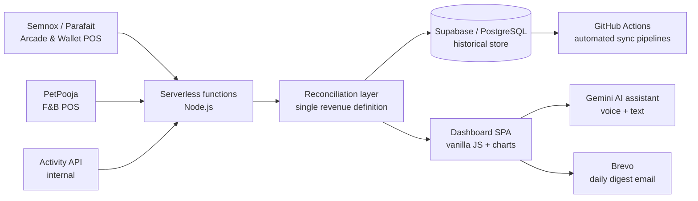

# FEC Analytics Platform — Case Study

> A real-time, multi-POS business intelligence platform I designed and built end-to-end for a **22-outlet family-entertainment chain across India** — consolidating three point-of-sale systems into one source of truth with **25+ analytics modules**, AI assistance, and automated reporting.

  
  
  
  
  
  
  

> 🔒 **Why this is a case study, not full source.** This platform runs on a real company's confidential operational data and proprietary POS integrations, so production code is kept private. This page documents the architecture, every analytics module, and the key engineering decisions. _Code walkthrough available on request._

---

## The problem

A chain of 22 entertainment outlets across India ran on spreadsheets and disconnected point-of-sale systems — a wallet/arcade POS in some stores, a separate F&B POS in others, and a third system for activities, each with its own data shape and quirks. Leadership had **no single, trustworthy, real-time view** of the business.

Answering "how did we do last week?" meant a full day of manual Excel work. Different reports gave different numbers. There was no way to know if a bad month was "fewer customers" or "customers spending less." F&B revenue was off by ~2× for weeks before anyone caught it.

---

## What I built

A single web dashboard that pulls from every source, reconciles it, and turns it into decisions. Built entirely from scratch, solo.

---

## Architecture

- **Frontend:** vanilla JavaScript single-page app — dependency-light, fast, no build step.
- **Backend:** Node.js serverless functions (Netlify) fetching, caching, and reconciling three POS systems.
- **Data layer:** Supabase (PostgreSQL) — migrated from a caching setup that kept timing out; automated GitHub Actions pipelines keep historical data fresh.
- **AI:** Gemini LLM answering natural-language questions with live dashboard data as context (voice + text input).

---

## Every analytics module

### Revenue & Operations

| Module | What it shows |
|---|---|
| **Revenue & Total Sales** | Per outlet, per company, per day. Activity / F&B / combined toggle. Handles Jus Jumpin (FEC) and The Knockout (sports bar) as separate companies in one view. |
| **Footfall & Spend-per-Head** | Separates "more customers came" from "each customer spent more" — the two tell very different stories. |
| **Time-wise & Hourly Sales** | Hourly revenue breakdown — identifies exact peak windows per outlet. |
| **Staffing Optimizer** | Translates peak-hour data into recommended counter headcount per time slot. |
| **Voucher Analytics** | Denomination breakdown, usage rates, OTP funnel tracking (14-day and 21-day redemption cohorts), charm pricing impact. |
| **Socks Sale Pattern** | Paid sock-session attach-rate by package and store. Counts only paid sessions (net >₹60), filters redemptions. |
| **Socks Ratio Maintenance** | Target vs actual attach-rate alert — flags underperforming stores in real time. |

### F&B Deep-Dive

| Module | What it shows |
|---|---|
| **F&B Compare** | Period A vs period B head-to-head across outlet / category / item / channel / payment method. Live dropdowns with multi-pick chips. |
| **Menu Engineering Quadrant** | Star / Plough-horse / Puzzle / Dog classification with editable food-cost % per item. |
| **F&B Attach Rate** | F&B revenue earned per guest beyond the activity ticket. |
| **Day-Part Sales** | Breakfast / lunch / dinner / late-night breakdown — shows where revenue concentration sits. |
| **Channel Economics** | Dine-in vs aggregator (Zomato / Swiggy) with configurable commission rates → true P&L per channel. |
| **Discount & Void Leakage** | Reconciled to PetPooja source exactly — quantifies revenue leakage from discounts and voided orders. |

### Customer Intelligence

| Module | What it shows |
|---|---|
| **Cohort & RFM Retention** | Which acquisition months retain customers vs which leak them out the bottom? Classic cohort triangle. |
| **Customer LTV** | Lifetime value per acquisition cohort — revenue accrued from first visit onward. |
| **Top Spenders** | Ranked client spend, filterable by date range and outlet. Identifies high-value customers for relationship marketing. |
| **Age Analysis** | Child / adult segmentation + age-band breakdown from 22,000+ customer DOBs via the internal customer API. Flags placeholder DOBs (Jan 1) automatically. |

### Predictive & Intelligence

| Module | What it shows |
|---|---|
| **Forecasting & Accuracy** | Expected revenue vs actual. Tracks how accurate previous forecasts were — builds trust in the model over time. |
| **Anomaly Detection** | Automated spike/dip alerts with deviation severity scores. Flags outliers without manual review. |
| **Weather-Sensitivity** | Pulls live Open-Meteo API data — correlates rainfall and temperature with footfall and revenue per outlet. |
| **Store Performance Prediction** | Forward projections with ML confidence bands — "based on trend, what should next week look like?" |
| **Targets & Pulse** | WoW / MoM / YoY deltas against editable RAG (Red/Amber/Green) targets per KPI — momentum at a glance. |

### Operations & Compliance

| Module | What it shows |
|---|---|
| **SOP & CCTV Performance** | Store compliance scores — checks whether standard operating procedures were followed, links deviations to revenue impact. |
| **Deviations & Operations Monitor** | Automated flag → revenue correlation. Shows the cost of operational deviation. |
| **Promotions Analysis** | Incentive programme ROI — did the promotion drive incremental revenue or just discount existing demand? |

### Platform Features

| Feature | Detail |
|---|---|
| **Live Geo Map** | All 22 outlets plotted on Leaflet.js — click any pin for store detail. Knockout (sports bar) also on map. |
| **Multi-company switch** | Jus Jumpin (FEC) and The Knockout (sports bar, separate POS) in one dashboard — switch at top level. |
| **Multi-POS** | Semnox/Parafait (arcade/wallet), PetPooja (F&B), and internal activity API — unified into a single revenue definition. |
| **AI Assistant** | Ask questions in plain English. Gemini LLM uses a live summary of the dashboard as context. Voice + text input. |
| **Global PDF/Excel export** | PDF via `window.print()` + `@media print` CSS suppression of nav. Excel via `.ms-excel` blob download — works on every tab. |
| **Daily Digest** | Automated 9am IST email to management via Brevo. Filter-aware — respects company and outlet filters. |

---

## Engineering highlights

### The F&B double-count that no one noticed for weeks

F&B revenue was reading ~2× too high across all outlets. Every dashboard said one number. PetPooja said another. Leadership didn't trust my reports.

Root cause: PetPooja's API, when asked for "orders on June 25th," quietly returned June 25th **plus** late-night orders whose timestamps had rolled over from June 24th. Every single day was being double-counted by the overnight session.

Fix: validate each order's own `order_date` against the day requested — ignore anything that doesn't match. One filter, applied consistently. Dashboard totals matched source systems **exactly** for the first time.

> This is the moment that rebuilt leadership trust in the numbers.

### Reconciling three completely different POS systems

Each POS system has its own data model, own definition of "a sale," and its own quirks:
- **Semnox/Parafait** (arcade/wallet): revenue = New Card + Recharge only. Activity transactions and bowling are card *usage*, not revenue. TransactionNetAmount inflates by ~2× if you use it naively.
- **PetPooja** (F&B): correct totals, but the date-rollover issue above. Also requires GET-with-body requests that `fetch()` can't handle — custom Node.js `https` module calls.
- **Activity API**: activity bookings, birthday parties, footfall source. Separate endpoint, different auth.

Building a single revenue definition that is *comparable* across all three systems took months of investigation and iteration.

### Migration from Netlify Blobs to Supabase/PostgreSQL

The original caching layer (Netlify Blobs) had a 10-second function timeout and kept failing on large date-range pulls. The fix wasn't "tune the cache" — it was migrate everything.

Supabase PostgreSQL now stores all historical data. GitHub Actions pipelines run scheduled syncs. New features ship in hours instead of fighting infrastructure. The database gives us the join queries and cross-outlet aggregations that were impossible before.

### Data integrity at scale

- F&B revenue reconciled to PetPooja source to the rupee
- Voucher incentive logic handles edge cases: owner-active per-store (not global), charm pricing, LEFT employee precedence
- Age analysis flags 18,000+ January-1 placeholder DOBs automatically
- Socks tracking filters ₹0 redemptions and sub-₹60 sessions that inflate attach rate

---

## Impact

- Leadership opens a **browser tab** instead of waiting a day for spreadsheet work.
- Revenue numbers **match source POS systems** — reports are trusted.
- 25+ analytics modules from a **single, self-taught, one-person build**.
- What took a day of Excel work now takes **seconds**.
- Anomaly detection flags issues **before** the weekly review meeting.

---

## Tech stack

`JavaScript` · `Node.js` · `Serverless (Netlify Functions)` · `Supabase / PostgreSQL` · `GitHub Actions` · `PetPooja API` · `Semnox / Parafait API` · `Gemini LLM API` · `Leaflet.js` · `Chart.js` · `Brevo API` · `Data Visualization` · `REST APIs` · `Git`

---

## Screenshots

> _Demo-mode screenshots with fictional data go in [`/docs`](docs/)._

---

### Author

**Souvik Kundu** — Business Intelligence & Automation Engineer.
Designed and built this platform entirely solo: data integration, reconciliation engine, backend, 25+ analytics modules, AI assistant, and deployment.

📫 [LinkedIn](https://linkedin.com/in/souvik-kundu-bi) · [GitHub](https://github.com/Souvikkundu369)
