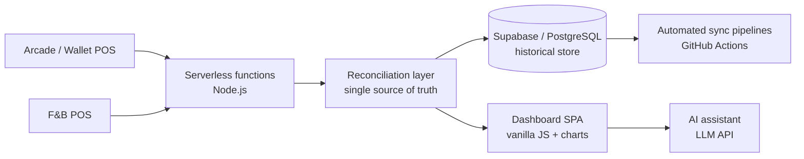

# 📊 FEC Analytics Platform — Case Study

> A real-time business-intelligence platform I designed and built end-to-end for a **multi-outlet family-entertainment chain (20+ locations)** — consolidating multiple point-of-sale systems into one source of truth, with 20+ analytics modules covering revenue, F&B, footfall, customer retention, forecasting and geo-analytics.

  
  
  
  
  

> 🔒 **Why this is a case study, not full source.** This platform runs on a real company's confidential operational data and internal POS integrations, so the production code is kept private. This page documents the architecture, the engineering decisions, and the outcomes. _Code walkthrough available on request._

---

## The problem

A chain of 20+ entertainment outlets ran on spreadsheets and disconnected point-of-sale systems — an arcade/wallet POS in some stores, a separate F&B POS in others, each with its own data shape and quirks. Leadership had **no single, trustworthy, real-time view** of the business. Answering "how did we do last week?" meant a full day of manual Excel work, and different reports disagreed with each other.

## What I built

A single web dashboard that pulls from every source, reconciles it, and turns it into decisions:

- **📈 Revenue & Total Sales** — per outlet, per company, per day; activity / F&B / combined views.
- **🍔 F&B analytics** — menu-engineering quadrants, per-guest attach rate, day-part sales, channel economics (dine-in vs. aggregators).
- **👥 Footfall & spend-per-head** — separates "more people" from "bigger spend."
- **🔁 Customer cohorts & RFM retention** — are new customers coming back, or leaking out the bottom?
- **🔮 Forecasting, anomalies & weather-sensitivity** — expected vs. actual, with rainfall/temperature modelling.
- **🗺️ Live geo map** — every outlet plotted, click-through to store detail.
- **🎯 Targets & momentum** — WoW / MoM / YoY deltas against editable RAG targets.
- **🤖 In-dashboard AI assistant** — ask questions about the data in plain English (voice + text).

## Architecture

- **Frontend:** vanilla JavaScript single-page app with custom charting — deliberately dependency-light and fast.
- **Backend:** Node.js serverless functions that fetch, cache, and reconcile POS data.
- **Data layer:** Supabase (PostgreSQL), migrated off an earlier caching setup that kept timing out; automated sync pipelines keep it fresh.
- **AI:** an LLM-backed assistant that answers natural-language questions using a live summary of the dashboard as context.

## Engineering highlights

- **Reconciling two very different POS systems** into one consistent revenue definition — deciding what counts as "sales" vs. stored-wallet balance, and making every outlet comparable.
- **A real data-integrity hunt:** F&B revenue was reading ~2× too high. Root cause — one POS API, asked for "orders on day X," also returned late-night orders that had rolled over from the previous day, so every night was double-counted. The fix (validate each order's own date) made dashboard totals match the source systems **exactly** — and rebuilt leadership's trust in the numbers.
- **Migration to Supabase/PostgreSQL** to kill timeouts and get a true single source of truth, so new features ship in hours instead of fighting infrastructure.
- **Automated what used to be manual** — daily digests, exports (PDF/Excel), and scheduled syncs replaced recurring manual reporting.

## Impact

- Leadership now opens a **browser tab** instead of waiting on a day of spreadsheet work.
- Numbers **reconcile to the source POS systems**, so reports are trusted.
- 20+ analytics modules from a **single, self-taught, one-person build**.

## Tech stack

`JavaScript` · `Node.js` · `Serverless (Netlify Functions)` · `Supabase / PostgreSQL` · `REST APIs` · `LLM / GenAI` · `Data Visualization`

## Screenshots

> _Demo-mode screenshots (fictional data) go in [`/docs`](docs). Add e.g. `docs/overview.png`, `docs/geo-map.png`, `docs/fnb.png`._

---

### 👤 Author

**Souvik Kundu** — Business Intelligence & Automation Engineer.
Designed and built this platform end to end: data integration, backend, analytics, AI, and deployment.

📫 [LinkedIn](https://linkedin.com/in/<your-custom-url>) · [GitHub](https://github.com/<your-username>)
